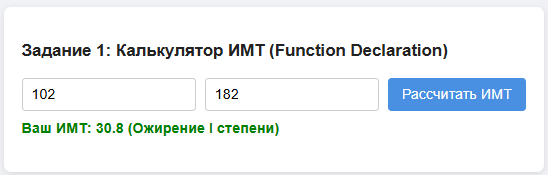
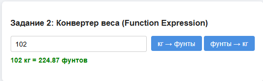
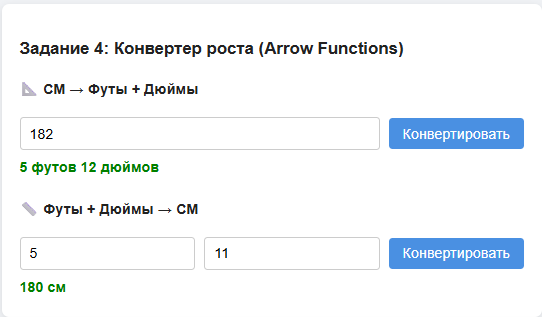

# 🧮 Практическая работа №3: Функции и Scope в JavaScript

> Проект «Калькулятор здоровья и фитнеса» — закрепление тем: Function Declaration, Function Expression, Arrow Functions, Lexical Environment, Closures.

🔗 [Посмотреть демо](https://igorao2802-dev.github.io/js-practice-03/) _(опционально)_  
📁 [Исходный код](https://github.com/igorao2802-dev/js-practice-03)

---

## 🛠 Используемые технологии

| Технология        | Назначение                                                                  |
| ----------------- | --------------------------------------------------------------------------- |
| HTML5             | Разметка страницы (4 секции: ИМТ, Калории, Конвертер веса, Конвертер роста) |
| CSS3              | Стилизация интерфейса (адаптивные карточки, валидация)                      |
| JavaScript (ES6+) | Логика расчётов: функции разных типов, валидация, работа с DOM              |

---

## ⚙️ Созданные функции и их назначение

### Задание 1: Калькулятор ИМТ (Function Declaration)

| Функция                        | Описание                                                            |
| ------------------------------ | ------------------------------------------------------------------- |
| `calculateBMI(weight, height)` | Расчёт индекса массы тела: `вес / (рост в м)²`                      |
| `handleBMI()`                  | Обработчик кнопки: валидация ввода, вызов расчёта, вывод результата |

### Задание 2: Конвертер веса (Function Expression)

| Функция                              | Описание                               |
| ------------------------------------ | -------------------------------------- |
| `convertKgToLbs(kg)`                 | Перевод кг → фунты (`кг * 2.20462`)    |
| `convertLbsToKg(lbs)`                | Перевод фунты → кг (`фунты / 2.20462`) |
| `handleKgToLbs()`, `handleLbsToKg()` | Обработчики кнопок с валидацией        |

### Задание 3: Калькулятор калорий BMR (Function Declaration + Scope)

| Функция                                     | Описание                                                    |
| ------------------------------------------- | ----------------------------------------------------------- |
| `calculateBMR(weight, height, age, gender)` | Расчёт базального метаболизма по формуле Миффлина-Сан Жеора |
| `handleBMR()`                               | Обработчик: сбор данных, валидация, вывод нормы калорий     |
| `MALE_BONUS`, `FEMALE_BONUS`                | Глобальные константы для демонстрации Lexical Environment   |

### Задание 4: Конвертер роста (Arrow Functions)

| Функция                                | Описание                                                   |
| -------------------------------------- | ---------------------------------------------------------- |
| `getInches(cm)`                        | Перевод см → дюймы (однострочная стрелочная функция)       |
| `getCm(ft, inc)`                       | Перевод футы+дюймы → см (однострочная стрелочная функция)  |
| `handleCmToFeet()`, `handleFeetToCm()` | Обработчики с валидацией и форматированием вывода (`5'9"`) |

---

## ❓ Ответы на контрольные вопросы (Interview Questions)

### 1. Что произойдет, если в функции нет оператора `return`?

> Функция вернёт `undefined` по умолчанию. Если результат не используется (например, функция только выводит в консоль или меняет DOM), это нормально. Но если вы ожидаете значение — получите ошибку логики, так как `undefined` не подходит для вычислений.

### 2. Почему стрелочную функцию нельзя вызвать до её объявления?

> Стрелочная функция обычно записывается в переменную через `const`/`let`. Такие переменные подвержены **Temporal Dead Zone**: они «всплывают» при hoisting, но недоступны до строки объявления. Попытка вызвать раньше вызовет `ReferenceError: Cannot access before initialization`.

### 3. Что такое «Замыкание» (Closure) простыми словами?

> Замыкание — это когда функция «запоминает» переменные из своей внешней области видимости, даже после того, как внешняя функция завершила работу. Пример: функция-валидатор, созданная внутри `createValidator(min, max)`, продолжает «видеть» `min` и `max`, потому что они замкнуты в её лексическом окружении.

### 4. Зачем нужен принцип "одна функция — одна задача" (Single Responsibility)?

> Чтобы код был:  
> ✅ **Понятным** — легко читать и отлаживать  
> ✅ **Переиспользуемым** — функцию можно вызвать в разных местах  
> ✅ **Тестируемым** — проще покрыть юнит-тестами  
> ✅ **Поддерживаемым** — изменение одной логики не ломает другие части

### 5. Чем отличается Function Declaration от Function Expression?

| Критерий      | Function Declaration                   | Function Expression                    |
| ------------- | -------------------------------------- | -------------------------------------- |
| Синтаксис     | `function name() {}`                   | `const name = function() {}`           |
| Hoisting      | ✅ Доступна до объявления              | ❌ Недоступна до строки объявления     |
| Имя функции   | Обязательное                           | Опциональное (анонимная)               |
| Использование | Для основных, переиспользуемых функций | Для колбэков, условного создания, IIFE |

### 6. Что такое hoisting для функции?

> **Hoisting (всплытие)** — механизм JavaScript, при котором объявления функций и переменных «поднимаются» в начало своей области видимости на этапе компиляции.
>
> - Для **Function Declaration**: функция полностью доступна до её объявления.
> - Для **Function Expression / Arrow Function**: переменная всплывает, но остаётся в Temporal Dead Zone до инициализации.

### 7. Почему стрелочные функции нельзя вызвать до объявления? _(повтор вопроса 2, но с акцентом)_

> Потому что стрелочные функции почти всегда присваиваются переменным через `const`/`let`. Эти переменные не инициализируются до выполнения строки объявления. В отличие от Function Declaration, где само тело функции всплывает полностью, здесь всплывает только ссылка `undefined`, и вызов до инициализации вызывает ошибку.

### 8. Что такое лексическое окружение (Lexical Environment)?

> Это внутренний механизм JavaScript, который хранит связь между функцией и переменными, которые были доступны в момент её создания.  
> 🔹 Когда функция ищет переменную, она проверяет:
>
> 1. Свою локальную область
> 2. Внешнюю область (где функция была объявлена)
> 3. Глобальную область  
>    Эта «цепочка» и есть **Scope Chain**, основанная на лексическом (статическом) окружении.

### 9. Почему важно комментировать выбор типа функции?

> 1. **Для команды** — другие разработчики поймут ваше решение без догадок
> 2. **Для себя** — через месяц вы вспомните, почему выбрали именно этот подход
> 3. **Для обучения** — формулировка причины закрепляет понимание темы
> 4. **Для собеседования** — умение аргументировать выбор — ключевой навык Junior-разработчика
> 5. **Для поддержки** — при рефакторинге легче понять, можно ли менять тип функции

---

## 📸 Скриншоты работы

  
  
  

---

_Задание выполнил: [Осадчий И.А.]_  
_Дата: 02.03.2026_
